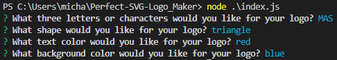

# Perfect-SVG-Logo_Maker

## Table-of-Contents

* [Description](#description)
* [Installation](#installation)
* [Usage](#usage)
* [License](#license)
* [Links](#links)
  
## [Description](#table-of-contents)
This command-line application takes the users input and generates a logo. The user inputs 3 characters, a text color, a shape and a background color. An SVG logo is then created. This will allow the user to have a simple logo for there projects without having to pay a designer.

## [Installation](#table-of-contents)
For installation you will need the code and inquirer.

## [Usage](#table-of-contents)
The application will start by using node ./index.js. The user will answer a series of prompts and the logo is created off the answers.

Walk through video link provided below.
  
## [license](#table-of-contents)
MIT License

## [Links](#table-of-contents)

[GitHub](https://github.com/mikestem)

[Walk Through Video](https://drive.google.com/file/d/1ltU3vzZljkx3nT0daHRz72QqUGgb2JjS/view)

  

